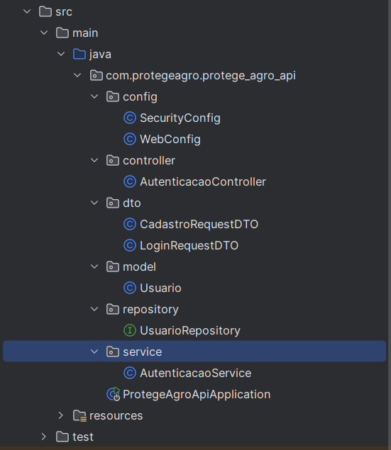

# Estrutura dos arquivos 

- Packages e classes adicionados manualmente:
    - config
        - ApplicationConfig.java
        - DevSecurityConfig.java
        - SecurityConfig.java
        - WebConfig.java
    - controller
        - AutenticacaoController.java
    - dto
        - CadastroRequestDTO.java
        - LoginRequestDTO.java
    - model
        - Usuario.java
    - repository
        - UsuarioRepository.java
    - service
        - AutenticacaoService.java
     

- Os outros arquivos são criados automaticamente quando utilizamos o Spring Initializr
